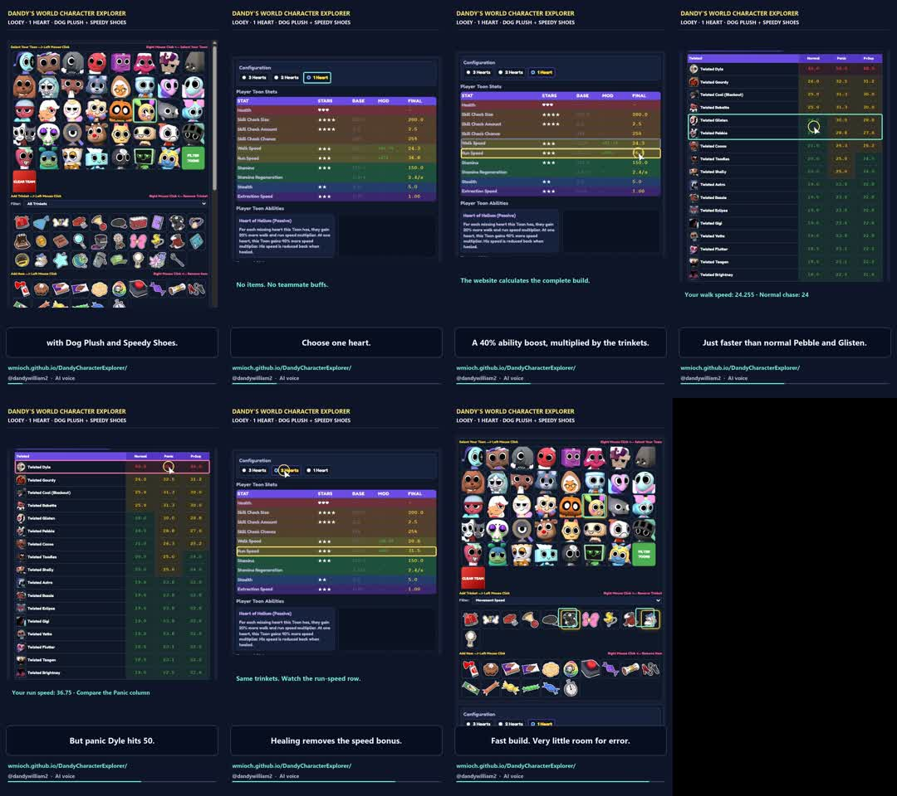

# Character Explorer video style guide

Status: user-approved direction, established 17 September 2026.

Weekly production and approval workflow: [weekly-workflow.md](D:/Projects/DandyCharacterExplorer-video/weekly-workflow.md). The user subsequently authorized Friday 04:00 generation and Saturday 08:00 Australia/Sydney upload, strictly after approval of the specific finished video. The durable queue is [video-queue.json](D:/Projects/DandyCharacterExplorer-video/video-queue.json). General no-upload defaults below still apply outside that explicitly approved workflow.

## Purpose and approval

Make short vertical videos that teach players how to use **Dandy's World Character Explorer** to answer a specific build question. The website is the subject, not merely the source of numbers.

The user approved the revised Looey walkthrough with “fantastic” and requested this guide for future agents. Their defining correction to the first draft was:

> “the bulk of the video is using the actual website … showing the website itself being used”

**Default to the website on screen throughout.** Show the actual controls, selections, configuration changes and resulting tables. Use captions and subtle highlights to help viewers follow them. Do not replace the demonstration with a sequence of illustrated stat cards or standalone charts.

This guide records the approved reference and sensible production defaults. Exact timing and pixel values below are reference settings, not a requirement to make every video identical. A newer explicit user instruction takes precedence.

## Approved reference

The approved version is **Looey-Website-Walkthrough.mp4**, not the earlier **Looey-One-Heart.mp4** infographic version.

On the current Windows machine:

```text
D:\Projects\DandyCharacterExplorer-video\looey-one-heart\website-version\Looey-Website-Walkthrough.mp4
D:\Projects\DandyCharacterExplorer-video\looey-one-heart\website-version\render_website.py
D:\Projects\DandyCharacterExplorer-video\looey-one-heart\website-version\captures\
D:\Projects\DandyCharacterExplorer-video\looey-one-heart\website-version\README.md
```

Supporting narration, audio segments, scene timings and calculation evidence are in the parent `looey-one-heart` directory. These files are local production artifacts, not tracked repository assets; check that they exist before relying on them. The renderer is a working reference for this specific episode, not a general tool that can be reused by changing only the title.

The repository includes a small contact sheet extracted from the approved export:



Watch the MP4 if the current tools support playback. Otherwise inspect this sheet, the renderer and captured UI states; do not claim to have watched or heard material that was only inspected as stills or text.

## What an episode should do

Answer one concrete player question and demonstrate how the Explorer answers it. For a build video, the usual sequence is:

| Beat | Typical duration | Show on the website | Narration purpose |
| --- | --- | --- | --- |
| Hook | 4–6 seconds | Relevant character grid or build | State the requested combination or question immediately. |
| Set up | 7–10 seconds | Select toon, filter/equip trinkets, choose condition | Let viewers see how to reproduce it. |
| Result | 7–10 seconds | Actual stat rows and applicable ability | Read the key values and briefly explain the cause. |
| Comparison | 7–10 seconds | Relevant Twisted or machine table | Explain what those values mean in practice. |
| Limit | 6–9 seconds | Relevant comparison column or changed setting | Show a meaningful exception or tradeoff. |
| Change one variable | 6–9 seconds | Hearts, trinket, team size or other control changes | Demonstrate the resulting change in the website itself. |
| Close | 4–7 seconds | Return to build or useful final table | Give a short takeaway and website address. |

The approved reference is 56.3 seconds. Aim for roughly **45–65 seconds**, shortening or lengthening when the actual explanation warrants it. Do not pad a simple answer to reach a quota.

For an update/tutorial video, replace the build sequence with the relevant feature flow. Keep the same principle: viewers see the feature being used while it is explained.

## Website footage and editing

- Use the real, unmodified website. Serve the local repository over HTTP when appropriate; never use `file://`. Follow root `AGENTS.md` and the selected browser skill. Do not launch a browser through shell commands.
- Use the browser the user requests. Reuse its supported connection and inspect controls before interacting. If using Chrome, keep capture work out of unrelated user tabs.
- Capture real before/after states: the selected toon, equipped trinkets, condition, result rows and comparison. Keep team abilities, items and other modifiers explicit. Start from a known setup rather than assuming defaults.
- When demonstrating team selection, choose teammates other than the selected player Toon so their team-selection markers remain clearly visible. For a Boxten walkthrough, use seven non-Boxten teammates; prefer distinct portraits and keep any teammate abilities inactive unless they are part of the stated build. Show the selection markers appearing as teammates are added.
- Teach the interaction, not just the resulting state. For every action beyond an ordinary left click, explicitly name the required gesture in the narration and on-screen instruction. Say “select seven teammates by right-clicking” while showing those right clicks. Likewise, say “right-click to remove” when removing trinkets, and explain any drag, keyboard shortcut or other less obvious interaction used. Do not rely on the website's small helper text to teach these gestures.
- The approved video is an **edited screenshot-based walkthrough**: actual browser captures, smooth editorial pans, click markers and row outlines. This approach is accepted. A genuine screen recording is also suitable. Describe the method accurately; do not call assembled still captures a continuous recording.
- Click indicators must correspond to real controls and actions that were actually performed. Do not simulate a nonexistent feature or alter values in screenshots.
- Keep the website large enough for phone viewing. Crop irrelevant margins; focus on the controls and rows currently being discussed. Preserve enough surrounding UI for viewers to recognise where they are.
- Use short, purposeful pans or cuts between sections. Hold important results long enough to read. Avoid constant zooming, cinematic transitions or decorative motion that competes with the interface.
- When a setting changes, show both the control and the resulting value together where practical. A before/after change is more informative than a static claim.
- Do not obscure the relevant cell with the cursor, caption box or highlight. Brief click rings and thin outlines are enough.
- Keep incidental overlays, browser chrome, white capture padding and unrelated UI out of the final crop. Do not conceal relevant contradictory evidence. If the app has a real defect affecting the demonstration, explain it rather than silently changing the application during video production.
- Reset temporary viewport overrides afterward and stop only the local server started for this work.

### Capture geometry: verify every time

The approved run requested a 540 × 960 viewport. Browser zoom/scaling produced a reported CSS viewport of 675 × 1200, and screenshot files included extra padding. The renderer therefore used the actual 675-pixel-wide content region. **Do not copy those capture coordinates blindly.**

Read current viewport dimensions and element bounds, inspect saved image dimensions and view a sample screenshot. For full-page captures, account for document versus viewport coordinates and scroll position. Check that highlights still enclose the intended row after cropping/scaling.

Some screenshot calls timed out in the reference run. Read the selected browser's troubleshooting guidance, verify the current state, and retry the supported capture method. Full-page capture followed by an editorial crop worked. Do not switch browser-control mechanisms or claim missing captures succeeded.

## Visual specification

Use a restrained dark frame that complements the existing site; retain the website's own colours and appearance inside the footage.

| Element | Approved reference setting |
| --- | --- |
| Canvas | 1080 × 1920, portrait 9:16 |
| Background | `#0e1428` |
| Main text | `#f8f8ff` |
| Mint accent | `#78f0d2` — emphasis and ordinary row outlines |
| Yellow accent | `#ffe36d` — branding, click rings and selected comparisons |
| Caution accent | `#ff799d` — a relevant limit, such as Dyle's speed |
| Divider | `#354267` |
| Caption panel | `#080e20` fill, `#4c5877` border, rounded corners |
| Typeface | Segoe UI / Segoe UI Bold on Windows; use a similarly readable sans serif if unavailable |
| Brand line | 29 px, yellow; “DANDY'S WORLD CHARACTER EXPLORER” |
| Build subtitle | 25 px, white; concise character/condition/trinket summary |
| Footage width | Around 1016 px, centred; resize/crop to suit the UI |
| Main captions | Around 39 px bold; normally one or two lines |
| Row outline | Around 5 px with small corner radius |
| Website address | Around 28 px, mint |
| Account / voice credit | Around 25 px, muted text |

Reference layout at 1080 × 1920:

```text
y 43       Brand line
y 90       Episode/build subtitle
y 143      Thin divider
y 175–245  Website view begins, depending on crop
            Main area: actual interface and relevant rows
y 1580–1724  Concise caption panel
y 1753     wmioch.github.io/DandyCharacterExplorer/
y 1806     @dandywilliam2 · AI voice
y 1850     Thin mint progress line
```

Treat this as a composition reference, not a guarantee of TikTok safe areas. Platform overlays can cover lower/right portions. Keep essential controls, results and captions clear; if a publication preview is available, check it and adjust. Do not shrink the website into an unreadable thumbnail to preserve an exact coordinate.

## Voice and captions

Keep production directions out of viewer-facing narration and captions. For example, choosing distinct teammates so markers remain visible is an instruction for the producer; viewers only need the actual interaction, such as "select seven teammates by right-clicking".

Prioritise small, useful mechanical insights: explain why a result changes, how modifiers interact, and what automatically calculated UI indicators mean. Build the episode around a verified discovery rather than only reading completion times. Show the relevant indicator before and after changing one control. For example, Stress Ball's STACKS badge displays the peak in the Explorer's machine calculation; skill-check chance, the Great-rate setting, stack expiry and machine completion affect that calculation. In the verified full-team Boxten example at 100% Great rate, adding Blue Bandana lowers chance from 25% to 20% and the displayed peak from 3 stacks to 2. Describe this as a modelled peak for that setup, not a universal in-game stack cap or a bonus applied for the whole machine.

The approved reference uses **AI-generated narration**, OpenAI voice `cedar`, with no background music. Retain this by default. It does not imitate the user's voice.

Read the current speech skill when generating narration. The reference model was `gpt-4o-mini-tts-2025-12-15`; use the skill's supported workflow and confirm availability rather than assuming an old model remains callable. Require an existing configured API key for paid speech calls; never print it or write it into artifacts.

Reference voice direction:

> Friendly, clear gaming explainer. Conversational and interested, not an advert. Brisk but easy to follow, with short pauses around numbers. Natural delivery, no exaggerated announcer voice.

Pronunciation examples: Looey = “LOO-ee”; Dyle rhymes with “dial”; Gourdy = “GOR-dee”. Add appropriate hints for the actual episode's names.

- Use plain speech: “Select Looey”, “choose one heart”, “watch the run-speed row”.
- Explain the result while the corresponding website state is on screen.
- Avoid unsupported superlatives, invented viewer promises, excessive hype and long introductions.
- Prefer a short takeaway and invitation to try the Explorer over a generic engagement pitch.
- Captions may be concise paraphrases rather than verbatim subtitles, as in the reference. They must preserve the meaning and numbers and appear with the relevant spoken statement.
- Time captions against the audio; do not divide each scene into equal thirds regardless of speech timing. Longer words and numeric explanations need more room.
- Keep captions to one or two readable lines. Move or resize the panel if it would cover the relevant website control.
- Include the visible “AI voice” disclosure when using generated narration.

## Factual accuracy and topic selection

Recalculate each episode from the current application and data. Earlier videos, comments and this guide are not current game-stat authorities.

1. Specify the toon, condition, trinkets, items, team size and active abilities.
2. Verify the real UI state and run the actual calculator when useful. Save the inputs and outputs. Load required dependencies such as `DataLoader` and stat mappings if evaluating the calculator outside the browser.
3. Distinguish exact values from UI rounding. The Looey reference used 24.255 / 36.75 internally and 24.3 / 36.8 in the displayed rows; these are examples, not values to hard-code into future episodes.
4. Compare the correct columns: normal chase, panic chase and panic with suppression are different. Label the selected case.
5. Do not equate a numerical speed advantage with guaranteed escape. Explain the relevant practical limitation when it matters to the build.
6. Describe calculator results as Explorer results. Independently verify current game facts if the script claims them beyond the app's data.
7. If a requested scenario depends on historical mechanics, label it historical and establish the correct data. Do not present an old pre-nerf build as current.

When the user asks for a viewer-request video, use the actual request and check whether it has already been fulfilled. Review accessible comment replies for promises. Do not invent a part number, requester name or outstanding commitment. Keep inaccessible comments and uncertain claims explicitly uncertain.

## Production files and delivery

Keep production output separate from application source by default:

```text
D:\Projects\DandyCharacterExplorer-video\<episode-slug>\
  README.md                 What was made, sources, method, validation
  narration.txt             Final script and voice direction
  scenes.json               Storyboard/caption information
  calculation-evidence.json Inputs and calculated results
  captures\                 Original browser captures and useful bounds
  audio\                    Generated narration segments
  render_*.py               Reproducible composition/rendering script
  contact-sheet.jpg         All scenes for visual review
  export-check.jpg          Frames decoded from the final export
  <episode-title>.mp4       Final deliverable
```

Create a new revision directory for substantial changes. Preserve the approved previous version. Do not overwrite the Looey reference or copy its outdated evidence into a new episode. Never store credentials in production files. Keep large videos, audio and raw captures out of the application repository unless requested; small documentation references are appropriate.

Reference renderer: Python, Pillow and FFmpeg. This is a proven implementation, not a required framework. Prefer reusing the rendering approach and voiceover workflow over introducing a large new video toolchain.

Export defaults:

- MP4 with H.264 video, 1080 × 1920 at 30 fps, `yuv420p`.
- AAC audio, 48 kHz, approximately 192 kb/s.
- FFmpeg CRF around 18–19; `+faststart` for immediate playback.
- Reference narration normalization: `loudnorm=I=-16:TP=-1.5:LRA=9`; explicitly set output audio to 48 kHz because normalization may change the internal sample rate.

Use `ffprobe` to measure actual audio duration. The reference TTS WAV files had streaming-style headers that made Python's `wave` frame count report an absurd duration; do not trust that count without checking it. Align each scene with its voice segment, with only a short pause between sections.

Creating a video does not authorize uploading it. Deliver the MP4 in the conversation with an absolute-path inline video and download link. State its duration and anything materially relevant, such as AI narration. Do not add scheduling or recurring automation merely because the user discusses making videos every few days.

## Quality check before delivery

- [ ] The website remains the principal visual, with real selections and results.
- [ ] A viewer can see how to reproduce the demonstration.
- [ ] Team markers are visible on portraits distinct from the player's selection, and every non-left-click gesture is explicitly explained when demonstrated.
- [ ] Every highlighted control/cell matches its on-screen position and current narration.
- [ ] Inputs, modifiers, exact values, rounded values and comparison columns are correct.
- [ ] View all scene previews at phone-like size; inspect setup transitions and changed-value states as well as static result shots.
- [ ] Captions fit, are readable and match the spoken meaning and timing.
- [ ] Check pronunciation and narration completeness using available audio tools; a transcript is useful for missing words/numbers but does not prove vocal quality.
- [ ] Extract and inspect frames from the **final encoded MP4**, not just source images.
- [ ] Decode the entire export without errors; verify duration, dimensions, frame rate, codecs and audio sample rate with FFmpeg/ffprobe.
- [ ] Preserve evidence and reproducible source files; accurately describe whether the footage is a recording or edited browser captures.
- [ ] Restore temporary browser settings and stop the server started for capture.
- [ ] Deliver the video without uploading, publishing or scheduling unless asked.

This is artifact verification, not a reason to introduce application tests or change app code. Leave unrelated work in the repository alone.

## Reusable brief for a future agent

```text
Create a TikTok-style Character Explorer video about [TOPIC / VIEWER REQUEST].
Follow docs/video-style-guide.md and the approved Looey website walkthrough.
Keep the actual website on screen, demonstrate the controls being used,
and explain its real results with restrained highlights and concise captions.
Use the current app/data and verify the precise build and comparison columns.
Use a conversational AI voiceover matching the reference unless I say otherwise.
Save a new episode folder with the MP4, captures, script, renderer and evidence.
Check the final export and return an inline video and download link.
Do not upload it.
```
